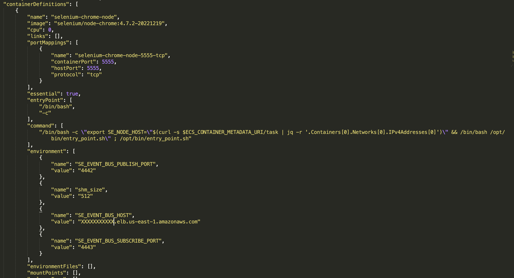
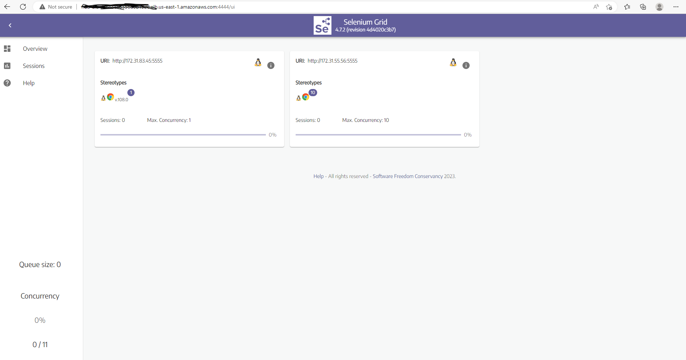

# Run selenium tests at scale using Latest Selenium Grid 4 ECS Fargate
Finally we have the selenium grid 4 on ECS fargate now we can run integration and regression tests quicker and cheaper to improve the CI/CD process.

I might not have followed the best practices. But this should give you an idea how to implement.

# Introduction
NOTE: This Selenium Grid 4 is created using AWS CLI and Console and Idea of this implementation was inspired from project
https://github.com/aws-samples/run-selenium-tests-at-scale-using-ecs-fargate

Let us consider a scenario where the developer has added a new feature or made a bug fix to an existing product and checked the changes. As part of the CI/CD pipeline, the new code gets built, unit test cases are run and deployed in a QA or staging environment. Once the deployment is successful QA team will run the integration and regression test cases to certify the build. In a typical case, the number of test cases may vary between hundreds to a few thousand, so executing these test cases will take time, eventually slowing down the phase in which features get deployed in production. The traditional way of accelerating this test case execution is one of the following:

- Add more resources to the QA team so they can start these test case execution in parallel from multiple machines, monitor them, and collect results
- Add more physical machines or VM's, so we have enough browser agents to run these tests rather than relying on local machines

This method is not scalable and costs both money and time. The approach explained here focuses on this specific problem and walks through how we can run these test cases quicker without costing a lot of money and time.

> Note: The approach highlighted here is only applicable for testcases executed using selenium framework

# Testcase Flow

# Steps to Create the Infrastructure

1) Create a VPC with 2 Public Subnets and 2 Private Subnets(use NAT gateway for internet access) ** we can also use the Default VPC

2) Connect to AWS cloudshell

3) Create a Network load balancer using the below command. we should not use Application load balancer as selenium grid 4 uses TCP communication for EVENT_BUS registration. Copy and note down loadbalancer arn

   - aws elbv2 create-load-balancer --name hub-alb-7 --type network --subnets subnet-1 subnet-2

4) Create 3 target groups for hub to listen in 3 ports. Copy and note down the target groups arn

    target group 1 for listening selenium requests

    - aws elbv2 create-target-group --name target-hub --protocol TCP --port 4444 --target-type ip --vpc-id vpc-23224frgrthth

    target group 2 for publisher

    - aws elbv2 create-target-group --name target-pub --protocol TCP --port 4442 --target-type ip --vpc-id vpc-23224frgrthth

    target group 3 for subscriber

    - aws elbv2 create-target-group --name target-sub --protocol TCP --port 4443 --target-type ip --vpc-id vpc-23224frgrthth

5) Create Listeners for NLB using the below commands:

    Listner for port 4444

    - aws elbv2 create-listener --load-balancer-arn \<load balancer arn\> --protocol TCP --port 4444 --default-actions Type=forward,TargetGroupArn=<target group 1 arn>

    Listner for port 4443

    - aws elbv2 create-listener --load-balancer-arn \<load balancer arn\> --protocol TCP --port 4442 --default-actions Type=forward,TargetGroupArn=<target group 2 arn>

    Listner for port 4442

    - aws elbv2 create-listener --load-balancer-arn \<load balancer arn\> --protocol TCP --port 4443 --default-actions Type=forward,TargetGroupArn=<target group 3 arn>

5) Create Task Defination for selenium hub as per the json configuration in the ECS

6) Create Task defination for node chrome as per the json configuration in the ECS. Replace the SE_EVENT_BUS_HOST value with your NLB dns

7) Update the details and Upload the selenium-service.json file to the cloudshell and execute the below command.
    - aws ecs create-service --cli-input-json file://selenium-service.json --region us-east-1

8) Update the details and Upload the node-chrome-service.json file to the cloudshell and execute the below command 
    - aws ecs create-service --cli-input-json file://chrome-service.json --region us-east-1

9) Once all services are deployed and running. Goto your load balancer and copy the DNS 

10) Open the browser, paste the URL and append with port 4444. Finally you should see the selenium and nodes configured
    - example: http://XXXXXXXXXXXX.us-east-1.amazonaws.com:4444/ui

11) Execute tests on chrome:
    - ChromeOptions options = new ChromeOptions();
    - options.setHeadless(true);
    - WebDriver driver = new RemoteWebDriver(new URL("http://XXXXXXXXXXXX.us-east-1.amazonaws.com:4444/wd/hub"), options);

Helpful Links :

    https://www.selenium.dev/documentation/grid/

    https://github.com/SeleniumHQ/docker-selenium

    https://docs.aws.amazon.com/elasticloadbalancing/latest/network/network-load-balancer-cli.html

    https://docs.aws.amazon.com/AmazonECS/latest/developerguide/register-multiple-targetgroups.html

    https://github.com/aws-samples/run-selenium-tests-at-scale-using-ecs-fargate

    https://stackoverflow.com/questions/73567175/node-is-not-able-to-connect-to-hub-keep-sending-registration-event

    https://www.webelement.click/en/selenium_grid_4_complete_guide_to_configuration_flags

    https://code.mendhak.com/selenium-grid-ecs/

    https://github.com/taktakpeops/selenium-grid-ecs-fargate

